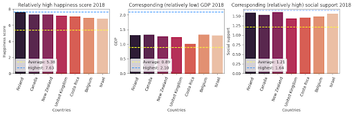

# What Makes People Happy?

## Introduction & Goal

Have you ever wondered what truly makes a country happy?

We'll be exploring the 2018-2019 World Happiness Report to uncover the key drivers of happiness, and to demonstrate that "softer" social factors can be just as, or even more, influential than economic prosperity.

### Research questions
- Which factors have the strongest link to happiness?
- How do strongest factors contribute to happiness?
- What separates the happiest countries?
- Does corruption undermine happiness?
- Can other factors make up for lower GDP?

## Data source

[World Happiness Report (2018-2019)](https://www.worldhappiness.report/)

## Insights preview

## Key findings
- GDP, social support, and freedom of choice stand out as the strongest drivers of happiness and 'softer' factors can sometimes compensate for lower economic output
- Overall, happiness is shaped by feeling supported, having the freedom to make choices, and living in a society that cares for its citizens
- Well-being is about more than just money

## Detailed report

To explore the complete analysis, see [What makes people happy?](presentation/what_makes_people_happy_allwomen_da_module_2_liza_ossipova.pdf)

## Tools used
- Python
- Pandas for data manipulation
- Matplotlib/Seaborn for visualisation
- Jupyter Notebooks for analysis

## Author & Acknowledgement

This exploratory data analysis was conducted by [Liza Ossipova](https://www.linkedin.com/in/lizaossipova/).

Completed in September 2025 as part of [allWomen Data Analytics Bootcamp](https://www.allwomen.tech/bootcamp/data-analytics-bootcamp/).
